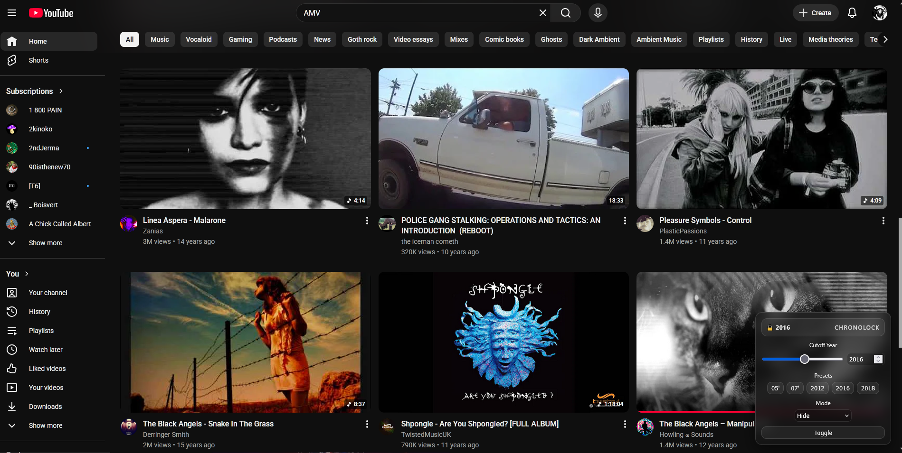
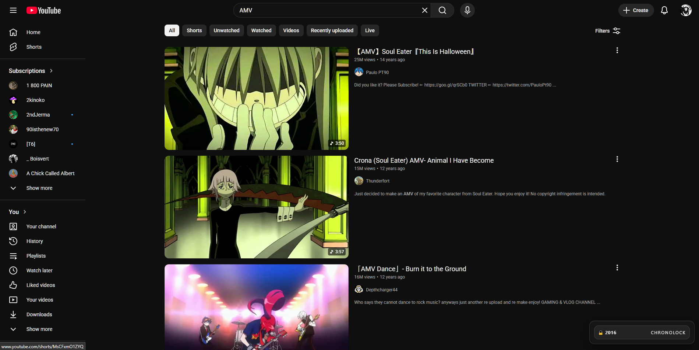
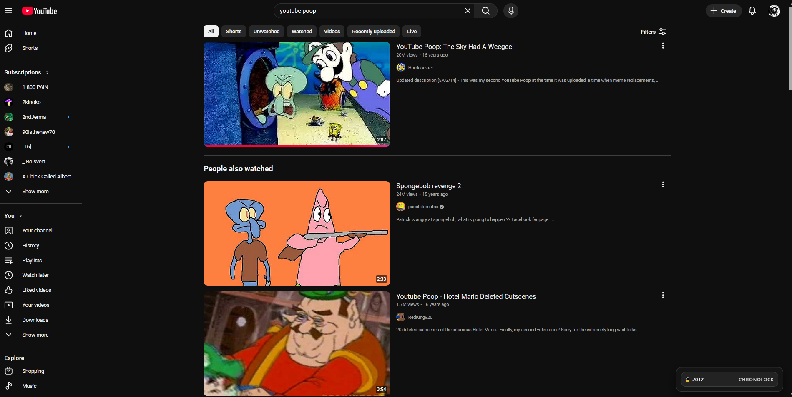

# CHRONOLOCK

<p align="center">
  
</p>

A lightweight Firefox extension for filtering YouTube videos by upload age.

ChronoLock allows you to hide, dim, or fade videos newer than a selected cutoff year, reshaping YouTube into something slower, stranger, and more archival. Built for nostalgia, intentional browsing, old internet archaeology, and resisting the platform’s constant pressure toward recency.



---

## Features

* Filter videos newer than a chosen year
* Three filtering modes:

  * **Hide** — removes videos entirely
  * **Dim** — desaturates and lowers opacity
  * **Fade** — visually suppresses videos without removing layout space
* Floating in-page control panel
* Persistent saved settings
* Lightweight vanilla JavaScript implementation
* No telemetry
* No tracking
* No data collection




---

## Installation (Firefox)

### Temporary Install (Developer Mode)

1. Open Firefox
2. Navigate to:

```text
about:debugging#/runtime/this-firefox
```

3. Click:

```text
Load Temporary Add-on
```

4. Select `manifest.json` inside the ChronoLock folder

> Temporary installs will be removed when Firefox closes.

---

### Permanent Install (Recommended)

🔗 Install ChronoLock on Firefox: https://addons.mozilla.org/en-US/firefox/addon/chronolock/
Install through Mozilla Add-ons (AMO) once published (pending as of 5/15/26!)

* Survives browser restarts
* Updates automatically
* Intended for normal use!

---

### Manual `.xpi` Install (Testing / Advanced ~ Not Yet Available)

* Download the `.xpi` file
* Open Firefox
* Drag the `.xpi` into the browser window
* Confirm installation

---

## Folder Structure

```text
chronolock/
├── manifest.json
├── content.js
├── LICENSE
├── README.md
└── icons/
    ├── 48.png
    └── 96.png
```

---

## License

ChronoLock is licensed under the MIT License.

You are free to use, modify, distribute, and sublicense this software, including for commercial use, provided that the original copyright notice and license are included in all copies or substantial portions of the software.

The software is provided “as is”, without warranty of any kind.

---

## Notes

YouTube changes its internal structure frequently. Future platform updates may occasionally break filtering behavior until the extension is updated.

ChronoLock intentionally avoids heavy frameworks and build pipelines in favor of a small, transparent codebase that can be easily modified and understood.

---

Created by Enargeia.
